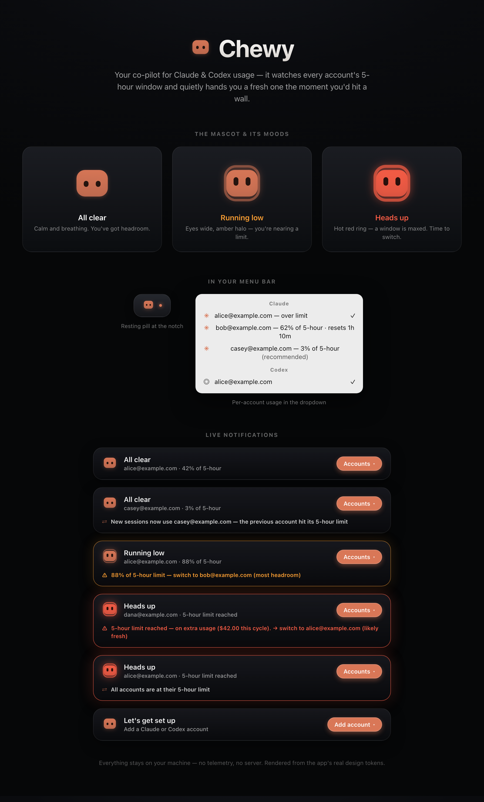

# Chewy

**Never hit a rate limit mid-flow again** — a tiny macOS menu-bar app that watches your Claude/Codex usage across accounts and auto-switches the moment you hit your 5-hour limit.



## Features

- **Usage meter in the menu bar** — the mascot shows the active account's 5-hour usage and turns warning/critical before you'd find out the hard way.
- **Auto-switch** — fires on the 5-hour wall (>95%), a drained weekly budget, or live overage. Picks the best alternative with simulation-tuned scoring (most headroom, reset-aware, weekly-budget tiebreaks); when *every* account is maxed it rides whichever resets soonest. The policy is regression-guarded by a discrete-event simulator in the test suite.
- **Self-healing sign-ins** — token rotations and manual `/login`s are captured continuously; after every switch the landing account's token is refreshed by delegating to the official CLI (never by touching idle accounts' single-use refresh tokens). A genuinely dead sign-in is escaped automatically and quarantined until you reconnect it.
- **Per-account usage in the dropdown** — every signed-in Claude and Codex account with its current 5-hour percentage, a reset countdown, and a marked recommendation. Codex accounts auto-switch on the same policy.
- **Island notifications** — a liquid-glass overlay announces switches and warnings, then fully disappears after ~10 seconds without interaction. No Dock icon, no permanent pill, no clutter.
- **Table stakes** — launch at login, remove account, reconnect in place (no duplicate accounts).

## How it works

Claude Code and Codex each read one *canonical* credential when a new session starts:

- **Claude**: the `Claude Code-credentials` item in your login Keychain, plus the identity in `~/.claude.json`
- **Codex**: `~/.codex/auth.json`

Chewy keeps a private, app-owned copy of each account's credential and, on switch, rewrites the canonical locations so **new sessions** (new terminal tabs, new CLI runs) use the chosen account. **Running sessions are untouched** — nothing is killed, logged out, or interrupted.

Every write is verified and rolled back on mismatch, captures are identity-attributed (a credential can never land on the wrong account), and token freshness is maintained by delegating refresh to the official `claude` CLI against its own store — the app never calls the OAuth refresh endpoint itself and never touches an idle account's single-use refresh token.

## Privacy

Everything stays on your machine. Tokens live in your login Keychain; account metadata lives in `~/Library/Application Support/Chewy` with owner-only permissions. There is no telemetry and no server. The app calls exactly two endpoints, over HTTPS and authenticated with your own tokens: Anthropic's usage API for Claude accounts and the ChatGPT backend's Codex usage API (the same call `codex` makes for `/status`) for Codex accounts — that's how it knows how full each 5-hour window is.

## Install

### Download (Apple Silicon)

Grab `Chewy.zip` from the [latest release](https://github.com/RohitMidha23/chewy/releases/latest), unzip it, and move `Chewy.app` to `/Applications`. It's ad-hoc signed (not notarized — no Apple Developer account), so macOS quarantines the download; clear it and launch:

```bash
xattr -dr com.apple.quarantine /Applications/Chewy.app
open /Applications/Chewy.app
```

It lives in the menu bar — there is no Dock icon.

### Build from source

```bash
git clone https://github.com/RohitMidha23/chewy.git
cd chewy
./Tools/build-app.sh
```

Then move `dist/Chewy.app` to `/Applications` and **right-click → Open** the first time.

**Requirements:** macOS 14+ and the Xcode Command Line Tools (Swift 6 toolchain).

## FAQ

**Why does macOS show a Keychain prompt on first run?**
Chewy reads and writes the same Keychain item Claude Code uses. Click "Always Allow" so you aren't re-prompted. Because the build is ad-hoc signed, a rebuild looks like a new app to the Keychain and may prompt again — just click "Always Allow" once more.

**Where are the logs?**
Right-click the menu-bar icon → *Show Log File*. Chewy writes `~/Library/Application Support/Chewy/Logs/chewy.log` (usage percentages, switch decisions, sign-in captures, HTTP status codes — never tokens). The same lines go to the unified log under subsystem `io.github.rohitmidha23.chewy`.

**Adding a second account captured the same account again — why?**
`claude auth login` opens claude.ai in your browser, which signs in with whatever account it is *currently* logged into. Switch accounts on claude.ai (or use a private window) before clicking "Add Claude account". Chewy now tells you when a sign-in landed on an account that is already in the list instead of silently merging it.

**Does switching log me out of anything?**
No. Switching only changes which account **new** sessions pick up. Sessions that are already running keep their credentials and keep working.

**Is this against the providers' Terms of Service?**
You're using your own accounts' own credentials on your own machine — no sharing, no scraping, no credential extraction beyond what the CLIs themselves store. That said, it relies on undocumented CLI internals and rewrites your real logins locally: read the source and use your own judgment.

## License

[MIT](LICENSE)
